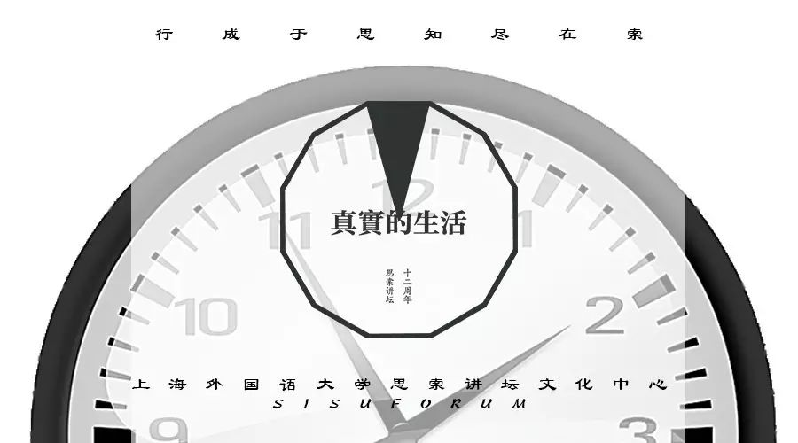
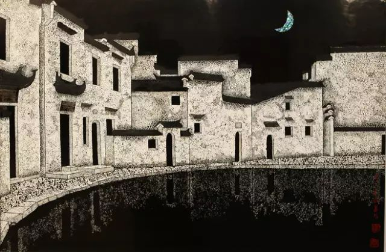

思索讲坛  *2017-03-21*

在确定今年周年庆主题的时候，我们在一张木桌上谈到了人的处境。从哲学意义上的异化出发，谈到法兰克福学派对于资本主义社会的文化批判，然后我们更进一步走进了当下的时代，这个物质丰饶，但是却精神孱弱的时代。但转念一想，不，我们所要达到的并不是理论的自洽，亦不是去玩术语游戏，我们在说的，确实是我们的生活，而且也应是我们的生活。

是否常有些时候，在那欢闹之余，在那无人作伴的空档中，我们感到了一阵不出意料的难受，一种空洞但是又浸没四方的晦暗情绪，将我们深深地包围在了无聊的梦魇里。可是即便我们从一种无聊的状态进入了下一个环节，开始了机械地运作，做着所谓的奋斗，为着一个所谓的体面生活，不断地消耗自己的情绪，以致五感不再敏锐，焦虑与疲劳像一种难以医治的疾病一样，开始缠绕着你的生活。

这是一个异常丰盛的世界，在这个时代，人所忧心的已经不再是简单的温饱问题。暴力的政治**似乎**离我们已经很远，贫困**似乎**已经不在我们目所能及的范畴里。或许可以假定，我们今天所拥有的，是前人不及的，但是否思考过，人以多大的代价换取今天？或许正是因为这些失去的东西，让我们开始变得不完整。

列车行驶过丘陵与平原，一路向北，山色渐而退却，隐没在平原下，远方树立起巨大的烟囱，朝着灰色的天空喷吐着苍白的浓烟。梦里的长河不再了，化肥与机油倾泻进河流里，在那流动的浮表上，有五彩斑斓的油花，像一个光怪陆离却令人难安的梦境一样。塔吊在城市的地表林立起来，在扬尘滚滚中与远处地平线上的高压电网，互相眺望，仿佛在以目示意某种巨大的阴谋。列车继续向前，进入一片城市，透过暮色霭霭的空气，看到那些拔地雄起的林楼，表面正在反射着一片不真实的阳光。水泥，钢筋，纵横交错，天际线分裂。打桩机的声音，地铁加速时渐渐升高的巨大噪响，咳嗽声，没有意义的嘈杂争论。广告牌在夜幕下更加显眼，在高射灯的照射下，在每一处转角制造幻觉。而行走的人，步履匆忙，一脸惨白，错乱地比肩接踵，汇成了巨大的黑影，从地铁里出来，挤上向上传送的电梯，犹如被耗费过度的消耗品那样，对物的占有成为梦想，但繁华却与他们无关。似乎这一切都像在无序地进行下去，而我却看到了一种秩序的可怖，它们在被有组织的安排下去，继续增长。在此之间，人被消耗，连带着自己的生活，在一个漫无目的的夜晚，构成了一个巨大的问号。

这不是卡夫卡式的预言，血腥的实话是晦暗的。这是一个巨大的迷局，并不真实，肉身走进迷局里，而灵魂无处可去。生命被有机地吞噬，生活被有机地组织，在一种繁华的巨大幻觉里，我们沉迷，却在最难捱的时刻，反思无路。而我们很多时候没有想过，未经检验的生活是否值得过？

海德格尔早已讨论过人与技术、技术与自然的关系。在一种生活被技术有组织的吞噬的时候，人的焦虑和空虚感，都是一种必然的产物。而人需要透气，就像从淹没自己的黑色的湖水中，探出头去感受一个澄清的世界。于是到此，我们重新思考这样的生活，它是否得当，是否合理？我们试图以某种形式让人思考，这样的生活是否合理，我们试图去检验生活。

这不是一个追求绝对自由的问题，而是要追求思索。在此我们希望打开一个场域，让人们能够在这个场域中去接近真实，去从洞穴中走出来，沉浸在普照的光辉里。无论是海德格尔以诗，或者是哈贝马斯以艺术，为一种麻痹的生活提供一种思索的可能性，以此去找到真实生活的可行性，以此聊慰一颗尚存的热心，哪怕行程艰难。或许在此，务虚才是一种诚实。我们希望在这方小小的天地里打破假象，摔碎谎言，从一个拜物浮躁的社会中为更多的人另辟蹊径，带着一种理性的批判，去探索一种真实生活的可能，这并不是一种救世狂想，而是对于心意合一者的成全。思索十二年，走过一轮，只要年岁不停，灵魂不死，请继续和我们一直如此思索下去。

文／陈迅超

编辑／戴翔宇

头图&尾图 / 周江泽

十二周年logo / 徐皓贤

图源网络

